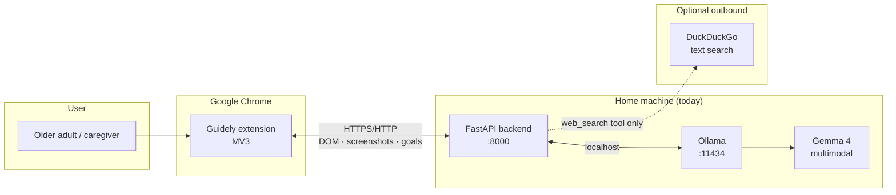
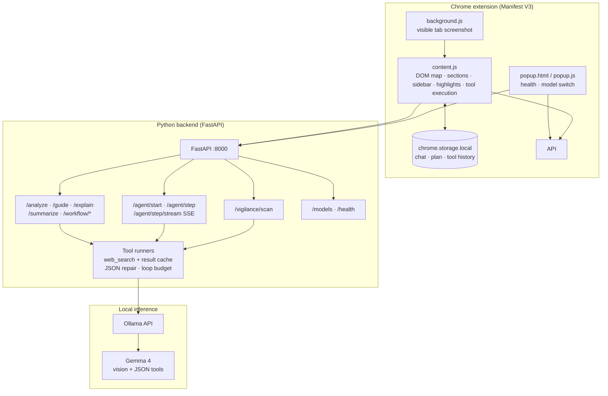
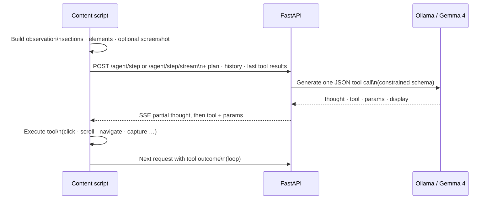
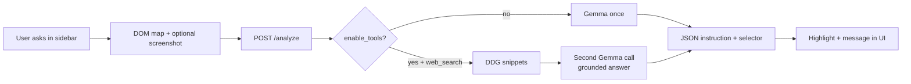
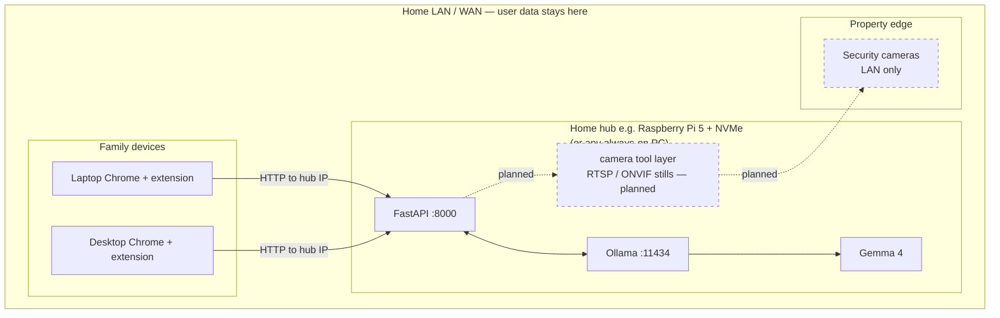
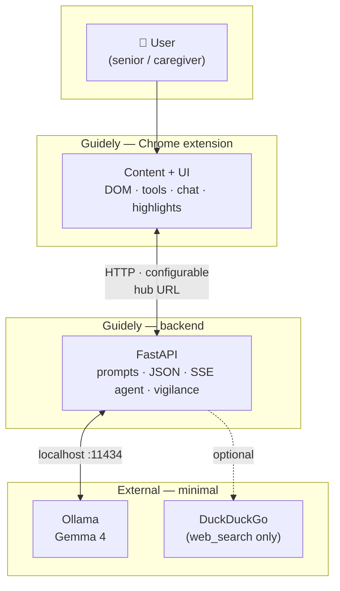

# Guidely — architecture diagrams

Use these for README, Kaggle attachments, or slides. **Mermaid** renders on GitHub and in many Markdown viewers. To export **PNG/SVG**: paste into [mermaid.live](https://mermaid.live) or use the Mermaid CLI.

---

## 1. System context (who talks to whom)

---

## 2. Component view (extension + server + model)

---

## 3. Autonomous agent — one step (request/response)

---

## 4. “Help me” analyze path (guided mode)

---

## 5. Target deployment — LAN hub + cameras *(roadmap)*

Solid lines = shipped pattern. Dashed = planned.

---

## 6. Logical containers (compact, judge-friendly)

Same idea as a C4 container sketch—works in any Mermaid 9+ renderer.

---

### Quick export for Kaggle

1. Open [mermaid.live](https://mermaid.live).  
2. Paste diagram **1** or **2** + **5** side by side in the editor (or export separately).  
3. **Actions → PNG/SVG** for the writeup attachment.
