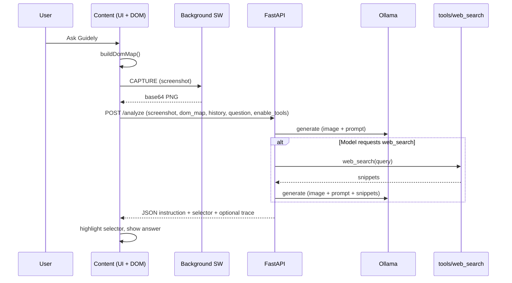

# Guidely — Feature Inventory & Extension Architecture

This document steps back from the current codebase to list **what we want Guidely to do**, propose a **maintainable architecture** for the Chrome extension (and how it fits the backend), and outline **phased implementation** so we can evolve without painting ourselves into a corner.

---

## 1. Guiding principles

| Principle | Meaning |
|-----------|---------|
| **Local-first** | Primary inference runs on Ollama; no cloud LLM required for core flows. |
| **Least privilege** | Extension requests only permissions it needs; backend validates all inputs. |
| **Single responsibility** | Content script = page UX + DOM; background = privileged APIs; popup = settings/status; backend = orchestration + Ollama. |
| **Explicit failures** | Errors surface in the UI with actionable messages (already partially done). |
| **Testability** | Pure logic in small modules; HTTP/Ollama mocked in tests. |

---

## 2. Feature inventory (current + intended near-term)

### 2.1 Core user journey (must-have)

| ID | Feature | Status today | Notes |
|----|---------|--------------|--------|
| F1 | **Floating entry point** (“Help me”) on ordinary web pages | ✅ | MV3 content script |
| F2 | **Side panel / drawer** with question box + submit | ✅ | Inline HTML/CSS in `content.js` |
| F3 | **Fresh tab screenshot** per request (`captureVisibleTab`) | ✅ | Background service worker |
| F4 | **DOM map** of interactive elements (labels, selectors, cap ~30) | ✅ | Content script |
| F5 | **POST to local backend** `/analyze` with screenshot + dom_map + history + question | ✅ | `localhost:8000` |
| F6 | **Ollama multimodal** — image + text to Gemma | ✅ | `/api/generate` |
| F7 | **Structured JSON response** — instruction + optional selector + highlight | ✅ | Pulse overlay on element |
| F8 | **Conversation history** (last N turns) for follow-ups | ✅ | Last ~5 rounds pattern |
| F9 | **Toolbar popup** — backend health + model switcher | ✅ | `popup.html` / `popup.js` |
| F10 | **Error surfacing** in-panel (network, Ollama, validation) | ✅ | Improved with API `detail` |

### 2.2 Model & ops

| ID | Feature | Status | Notes |
|----|---------|--------|--------|
| M1 | Default / preferred model (**e4b** over e2b when installed) | ✅ | Detection order in backend |
| M2 | **Switch active model** via API + popup | ✅ | |
| M3 | Optional **trace** (`?trace=1`) for debugging latency/payload sizes | ✅ | |
| M4 | Per-request **`enable_tools`** | ✅ | |

### 2.3 Tools & augmentation

| ID | Feature | Status | Notes |
|----|---------|--------|--------|
| T1 | **Web search tool** (DuckDuckGo text results) when model requests it | ✅ | Second Ollama round |
| T2 | Safe tool contract — query strings only, no arbitrary URL fetch from model | ✅ | `tools/web_search.py` |

### 2.4 Extension platform / maintainability (what we want next)

| ID | Feature | Status | Target |
|----|---------|--------|--------|
| E1 | **Split content script** into modules (config, api, dom-map, ui, highlight, messaging) | ❌ | Single large `content.js` today |
| E2 | **Central config** — backend base URL, debug trace flag, max history | ⚠️ | Hard-coded constants |
| E3 | **`chrome.storage`** for settings (URL override, trace, onboarding done) | ❌ | |
| E4 | **Single message protocol** between content ↔ background (typed envelopes) | ⚠️ | Ad-hoc `{ type: 'CAPTURE' }` |
| E5 | **Optional devtools / logging** hook (debug flag only) | ⚠️ | Partial (`GUIDELY_DEBUG_TRACE`) |
| E6 | **i18n-ready strings** (or at least string table) | ❌ | English hard-coded |
| E7 | **Styles** isolated (shadow DOM or named CSS prefix — already prefixed `guidely-*`) | ⚠️ | Global `<style>` injection |

### 2.5 Backend maintainability (aligned with extension)

| ID | Feature | Status | Target |
|----|---------|--------|--------|
| B1 | **`analyze_guidely`** pipeline isolated from FastAPI route handlers | ⚠️ | Logic in `ollama_client.py` |
| B2 | **Prompt registry** — base / tools / follow-up prompts as named templates | ⚠️ | Single `prompt.py` strings |
| B3 | **Tool registry** — register `web_search`, future tools | ⚠️ | Explicit function + dispatch |
| B4 | **Structured logging** + optional request IDs for support | ⚠️ | Partial |

### 2.6 Future (not committed — backlog)

- Offline queue when backend down / retry UX  
- Per-site opt-out or “snooze” button  
- Accessibility: keyboard trap, focus management in panel, screen reader labels  
- Multiple backend profiles (dev/staging URL)  
- Rate limiting / payload caps documented for enterprise  

---

## 3. Problems with the current extension shape

1. **Monolithic `content.js`** — DOM, styles, API calls, history, and UI are intertwined; hard to test and risky to extend.  
2. **Magic strings** — backend URL and flags duplicated; no sync with popup.  
3. **No shared module bundler** — vanilla ES modules are supported in MV3 service workers and extension pages, but **content scripts** historically needed bundling or single file unless using `"type": "module"` carefully (Chrome supports ES modules in MV3 content scripts when declared). Worth standardizing on **small ES modules + optional esbuild** if we outgrow hand-maintained files.  
4. **Popup vs content duplication** — health check logic exists only in popup; content script could show “backend down” before capture.

---

## 4. Target architecture (extension)

```
extension/
├── manifest.json
├── background.js              # Thin: route messages, captureVisibleTab only
├── popup.html / popup.js      # Settings + health + model (uses shared api/config if split)
├── styles/
│   └── panel.css              # Optional extract (or keep injected but imported as string from build)
├── modules/                   # ES modules (recommended)
│   ├── config.js              # DEFAULT_BACKEND_URL, read overrides from chrome.storage
│   ├── protocol.js            # MESSAGE_TYPES, validate payloads
│   ├── api.js                 # analyze(domMap, screenshot, history, opts) → fetch
│   ├── dom-map.js             # buildDomMap, selectors
│   ├── capture.js             # requestScreenshot() → chrome.runtime.sendMessage
│   ├── ui/
│   │   ├── sidebar.js         # mount/update sidebar DOM
│   │   ├── highlight.js       # overlay ring
│   │   └── floating-button.js
│   └── history.js             # guidely_history caps, serialization
├── content.js                 # Entry only: import init from ./modules/app.js
└── assets/
```

**Messaging contract (content ↔ background):**

```text
{ type: 'GUIDELY_CAPTURE_SCREENSHOT', requestId: string }
→ { requestId, ok: true, screenshotBase64 } | { requestId, ok: false, error: string }
```

**Why:** correlates async responses, easier to debug.

**Config:**

- `chrome.storage.sync`: `backendBaseUrl`, `debugTrace`, `enableTools` (mirror API default).  
- Fallback: `DEFAULT_BACKEND_URL = 'http://localhost:8000'`.

---

## 5. Target architecture (backend — minimal moves)

```
backend/
├── main.py                    # Routes only; thin
├── services/
│   └── analyze.py             # validate request → analyze_guidely → response model
├── ollama_client.py           # HTTP to Ollama + extract_json (keep)
├── pipeline.py                # Optional rename from nested analyze_guidely clarity
├── prompt/
│   ├── __init__.py
│   ├── base.py
│   ├── tools.py               # SYSTEM_PROMPT_WITH_TOOLS, etc.
│   └── builders.py            # build_user_turn
├── models.py
├── tools_bridge.py            # imports ../tools, executes tool_requests (optional split)
└── tests/
```

Keep **`tools/`** at repo root OR move under `backend/tools` long-term; today root `tools/` is fine if `PYTHONPATH` is documented.

---

## 6. Data flow (single ask)



---

## 7. Implementation phases (recommended order)

| Phase | Scope | Outcome |
|-------|---------|---------|
| **P0** | Document only (this file) | Shared understanding ✅ |
| **P1** | Extract **config + api.js** from content script; single `BACKEND` source | Less duplication, easier URL change |
| **P2** | Split **dom-map**, **capture**, **sidebar UI**, **highlight** into modules; thin `content.js` | Maintainable chunks |
| **P3** | **chrome.storage** for backend URL + debug trace | User-tunable without editing code |
| **P4** | Typed **message protocol** in background | Safer capture pipeline |
| **P5** | Backend: **`services/analyze.py`** + **`prompt/`** package | Matches mental model |
| **P6** | Optional **esbuild** rollup if module graph hurts load order | One bundled `content.bundle.js` |

---

## 8. Decision log (open questions)

1. **Bundler or native ES modules?** — Native ES modules in MV3 content scripts are supported in modern Chrome; if we hit CSP or load-order issues, add esbuild.  
2. **Shadow DOM for sidebar?** — Strong style isolation; slightly harder keyboard focus management — decide in P2.  
3. **Side Panel API vs injected div?** — Chrome Side Panel is another UX paradigm; current drawer is fine for seniors’ visibility — defer.

---

## 9. Summary

- **Features are listed** in §2 (inventory).  
- **Maintainability** means **splitting the extension**, **central config**, **clear messaging**, and **thin backend routes** with a dedicated analyze path.  
- **Implementation** should follow **P1 → P6** incrementally so each PR stays reviewable.

Next step: agree on **P1–P3** as the first implementation slice (config + api extract + storage), then execute in code.
